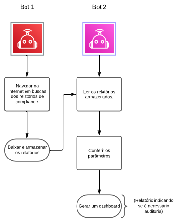

# AGIR - Automação para uma Governança Inteligente e Responsável no DF

## O que é AGIR?

AGIR é um projeto de Engenharia de Software e automação da Universidade de Brasília (AGIR-UnB), que foi inscrito e aceito no Programa Institucional de Bolsas de Iniciação em Desenvolvimento Tecnológico e Inovação, que tem como objetivo automatizar a análise de documentos de licitação (processo pelo qual a Administração Pública contrata obras, serviços e compras) do Distrito Federal. Para isso, será desenvolvido dois bots que irão trabalhar em conjunto para que a análise seja feito com a maior cobertura de documentos e com uma análise detalhade e minusiosa de cada um.

## Ferramentas

Para o desenvolvimento da automatização do processo anteriormente descrito, iremos utilizar as seguintes ferramentas de desenvolvimento:

- Python
- BeautifulSoup
- Requests
- Pandas
- Selenium
- Docker
- Linux

## Arquitetura



## Instalação e Uso com Docker

### Pré-requisitos
- Docker
- Docker Compose
- Make (opcional, mas recomendado)

### Configuração Inicial

1. **Clone o repositório:**
```bash
git clone <repository-url>
cd agir-unb
```

2. **Configure as variáveis de ambiente:**
```bash
cp env.example .env
# Edite o arquivo .env com suas configurações
```

3. **Use o Makefile (recomendado):**
```bash
# Ver todos os comandos disponíveis
make help

# Construir e iniciar os serviços
make up-build

# Ou manualmente:
docker-compose up -d --build
```

### Comandos Principais

| Comando | Descrição |
|---------|-----------|
| `make build` | Constrói as imagens Docker |
| `make up` | Inicia todos os serviços |
| `make down` | Para e remove os containers |
| `make logs` | Mostra logs de todos os serviços |
| `make logs-cli` | Mostra logs do serviço CLI |
| `make logs-dash` | Mostra logs do dashboard |
| `make shell-cli` | Abre shell no container CLI |
| `make run-lara` | Executa trigger para iniciar LARA-I |
| `make run-dani` | Executa trigger para iniciar DANI |
| `make status` | Mostra status dos containers |
| `make clean` | Remove containers, volumes e imagens |
| `make rebuild` | Reconstrução completa |

### Acessar o Dashboard

Após iniciar os serviços, o dashboard estará disponível em:
```
http://localhost:8501
```

### Documentação de Dependências

Para entender quais dependências do sistema são necessárias e por quê, consulte:
- [DEPENDENCIES.md](DEPENDENCIES.md) - Documentação detalhada das dependências

## Coordenadores do projeto

| Membro | Email | 
|:------:|:------:|
| Fátima de Souza | ffreire@unb.br |

## Equipe

| Membro | Email | GitLab |
|:------:|:-----:|:------:|
| Mateus S. Santana | | @Mateus-SS |
|Vinícius M. Martins| viniciusmendes1019@gmail.com | @yabamiah1 |
