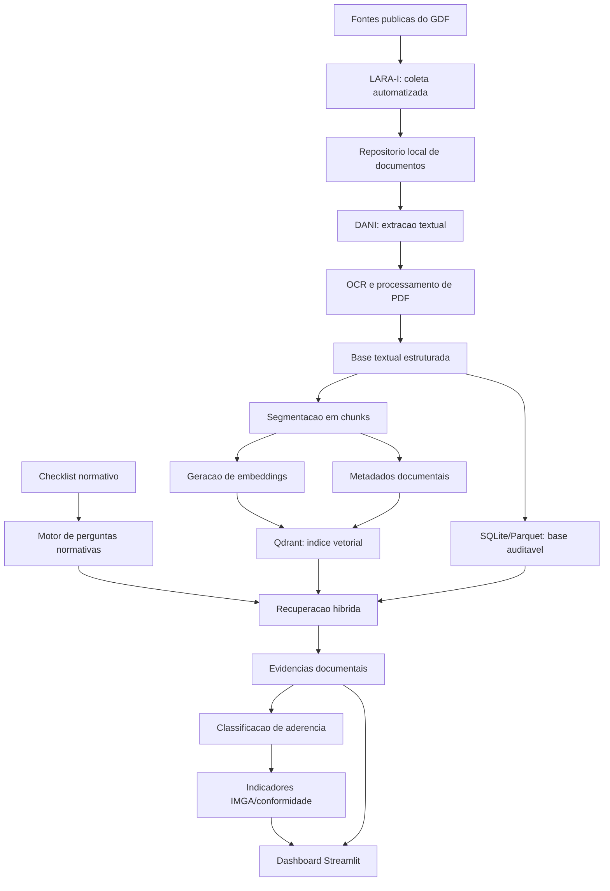

# AGIR-RAG Lite: Replanejamento Tecnico e Arquitetural

## Sprint 1 - Replanejamento Tecnico

Duracao estimada: 1 semana

Objetivo: formalizar a substituicao do RAGFlow por uma arquitetura propria, modular e mais leve para o projeto AGIR, preservando o objetivo cientifico de analisar documentos publicos de governanca e integridade com apoio de Recuperacao Aumentada por Geracao (Retrieval-Augmented Generation - RAG).

Entregaveis desta sprint:

- Documento justificando o abandono do RAGFlow.
- Desenho e especificacao da nova arquitetura AGIR-RAG Lite.
- Lista de tecnologias adotadas, com escolha do Qdrant como base vetorial.
- Criterios iniciais de sucesso tecnico e cientifico.

---

## 1. Justificativa para substituicao do RAGFlow

O projeto AGIR-RAG foi originalmente concebido com o uso da plataforma RAGFlow como componente central para ingestao documental, indexacao semantica, recuperacao de evidencias e geracao de respostas fundamentadas. Entretanto, durante a etapa inicial de avaliacao tecnica, identificaram-se restricoes operacionais, computacionais e metodologicas que comprometem a viabilidade de sua adocao no contexto atual de uma pesquisa de iniciacao cientifica.

A primeira limitacao observada refere-se aos requisitos computacionais necessarios para execucao local da plataforma. O RAGFlow depende de uma infraestrutura relativamente robusta, envolvendo multiplos servicos, conteinerizacao, mecanismos de indexacao e componentes de processamento documental que demandam memoria, armazenamento e capacidade de processamento superiores aos recursos atualmente disponiveis para o desenvolvimento do projeto. A ausencia de um computador com capacidade adequada para execucao estavel da plataforma torna o ciclo de testes, depuracao e validacao excessivamente oneroso para uma pesquisa aplicada de escopo academico.

Outro fator relevante e o custo associado ao uso de APIs de modelos de linguagem de grande escala. Embora a abordagem RAG reduza a necessidade de fine-tuning extensivo, a etapa de geracao e, em alguns casos, de embeddings, ainda pode depender de servicos pagos. Considerando que o projeto envolve potencialmente grande volume de documentos publicos, multiplos orgaos e repetidas rodadas de avaliacao, o custo acumulado de chamadas a APIs externas pode comprometer a sustentabilidade financeira e a reprodutibilidade da pesquisa.

Tambem se verificou elevada complexidade de instalacao, configuracao e manutencao do RAGFlow para uso proprio. A plataforma oferece uma solucao ampla, mas essa amplitude implica uma quantidade significativa de dependencias, parametros e servicos auxiliares. Para o presente projeto, cujo foco cientifico esta na coleta, classificacao, recuperacao e auditoria de evidencias documentais sobre integridade publica, a utilizacao de uma plataforma completa adiciona complexidade operacional que nao se converte integralmente em ganho metodologico.

Adicionalmente, a documentacao disponivel nao se mostrou suficientemente aprofundada para todos os cenarios de uso pretendidos pelo AGIR, especialmente no que se refere a adaptacoes finas de pipeline, auditoria dos criterios de recuperacao, rastreabilidade dos trechos e integracao direta com indicadores proprios, como o IMGA. A ausencia de guias recentes, exemplos detalhados e uma comunidade tecnica consolidada em torno de casos semelhantes aumenta o risco de dependencia tecnologica e reduz a previsibilidade do desenvolvimento.

Do ponto de vista metodologico, a substituicao do RAGFlow por uma arquitetura propria apresenta vantagens importantes. Uma solucao modular permite maior controle sobre cada etapa do processo: coleta, conversao, extracao textual, segmentacao, indexacao, recuperacao, classificacao normativa, calculo de indicadores e visualizacao. Esse controle e especialmente relevante em pesquisa cientifica, pois favorece a rastreabilidade, a auditabilidade e a explicacao dos resultados obtidos.

Outro beneficio da troca e a possibilidade de reaproveitar componentes ja existentes no ecossistema AGIR. O repositorio atual ja contem o LARA-I para coleta automatizada de documentos, o DANI para extracao e analise documental, modulos de processamento de PDF/OCR, motor NLP para classificacao por eixos e calculo do IMGA, alem de um dashboard em Streamlit. A nova arquitetura proposta, portanto, nao descarta o trabalho anterior; ao contrario, reorganiza os componentes ja desenvolvidos e adiciona uma camada RAG mais leve, controlavel e aderente ao problema de pesquisa.

Assim, a decisao de abandonar o RAGFlow nao representa uma reducao dos objetivos do projeto, mas uma adequacao tecnica e metodologica. A nova abordagem busca preservar os principios centrais do RAG - recuperacao de informacoes relevantes, geracao de respostas fundamentadas e citacao de evidencias - por meio de uma arquitetura mais simples, auditavel, escalavel incrementalmente e compativel com as condicoes reais de execucao da pesquisa.

## 2. Objetivo da nova abordagem

A nova proposta, denominada AGIR-RAG Lite, tem como objetivo construir uma camada RAG propria para o projeto AGIR, utilizando ferramentas especializadas e de menor custo operacional. A arquitetura devera permitir:

- coletar documentos publicos de governanca e integridade;
- extrair texto de PDFs nativos e digitalizados;
- segmentar documentos em trechos auditaveis;
- indexar os trechos em uma base vetorial com metadados;
- recuperar evidencias por pergunta normativa;
- classificar a aderencia dos documentos aos criterios legais;
- gerar indicadores de conformidade por orgao e tipo documental;
- apresentar os resultados em painel interativo.

## 3. Nova arquitetura AGIR-RAG Lite

A arquitetura proposta preserva os componentes existentes do AGIR e adiciona uma camada de recuperacao semantica baseada em Qdrant.



### 3.1 Camada de coleta

Responsavel por localizar, baixar e organizar documentos publicos relacionados a governanca, integridade e compliance. Esta camada sera baseada no LARA-I, ja presente no projeto, com separacao por tipo documental:

- atas de comites internos de governanca (`cig`);
- programas ou planos de integridade (`pg`);
- documentos de compliance (`compliance`).

Cada documento devera ser acompanhado de metadados minimos, incluindo orgao, tipo documental, URL de origem, data de coleta, nome do arquivo e status da coleta.

### 3.2 Camada de extracao textual

Responsavel por converter os documentos coletados em texto pesquisavel. Esta camada sera baseada no DANI e nos processadores ja existentes no projeto, com uso de PyMuPDF, pdfplumber e OCR quando necessario.

A saida esperada e uma representacao estruturada por documento e pagina, preservando o vinculo entre texto e fonte original. Esse requisito e essencial para garantir rastreabilidade e possibilitar validacao manual das evidencias.

### 3.3 Camada de segmentacao e metadados

Os textos extraidos serao divididos em trechos menores, tambem chamados de chunks. Cada chunk devera conter:

- identificador unico;
- orgao;
- tipo de documento;
- nome do arquivo;
- pagina de origem;
- trecho textual;
- hash do documento ou do trecho;
- data de processamento.

Essa estrutura permitira que cada resposta gerada pelo sistema seja acompanhada de evidencias verificaveis.

### 3.4 Camada vetorial com Qdrant

O Qdrant sera utilizado como banco vetorial para armazenar embeddings dos trechos documentais. A escolha do Qdrant se justifica por sua capacidade de operar em modo local, por sua organizacao baseada em colecoes, vetores e metadados, e por permitir evolucao posterior para uma execucao em servidor caso o volume documental aumente.

No contexto do AGIR-RAG Lite, cada ponto vetorial no Qdrant devera representar um chunk documental. O payload associado ao vetor devera armazenar metadados suficientes para filtragem e auditoria, como orgao, tipo documental, arquivo e pagina.

### 3.5 Camada de recuperacao hibrida

A recuperacao devera combinar dois mecanismos:

- busca semantica no Qdrant, para encontrar trechos conceitualmente relacionados a pergunta normativa;
- busca lexical em SQLite FTS5 ou mecanismo equivalente, para capturar termos juridicos, nomes formais, siglas e expressoes especificas.

A combinacao desses metodos reduz o risco de perda de evidencias relevantes. Em documentos normativos e administrativos, a busca puramente semantica pode ignorar termos formais importantes, enquanto a busca puramente lexical pode falhar quando o documento utiliza redacoes distintas para o mesmo conceito.

### 3.6 Camada normativa e classificatoria

As normas e criterios de integridade serao representados em um checklist estruturado. Cada criterio devera conter uma pergunta normativa, base legal, eixo analitico associado, palavras-chave auxiliares e regra de classificacao.

As respostas possiveis inicialmente propostas sao:

- atende;
- atende parcialmente;
- nao atende;
- nao encontrado.

Essa classificacao devera ser acompanhada das evidencias recuperadas, evitando que o sistema produza indicadores sem fundamentacao documental.

### 3.7 Camada de indicadores e visualizacao

Os resultados classificados alimentarao os indicadores de conformidade e o painel Streamlit ja existente. O painel devera permitir consultar:

- conformidade por orgao;
- conformidade por criterio;
- evidencias textuais associadas;
- documentos sem evidencias suficientes;
- evolucao e comparacao entre orgaos;
- pontuacao por eixo IMGA.

## 4. Tecnologias selecionadas

| Tecnologia | Funcao no projeto | Justificativa |
|---|---|---|
| Python | Linguagem principal | Ja e a base do repositorio AGIR e possui amplo suporte a NLP, OCR, automacao e analise de dados. |
| LARA-I | Coleta documental | Componente ja desenvolvido para busca e download de documentos publicos do GDF. |
| DANI | Extracao e analise documental | Componente ja existente para leitura, processamento e geracao de indicadores. |
| PyMuPDF | Extracao de texto em PDF | Rapido e adequado para PDFs com camada textual. |
| pdfplumber | Extracao complementar de PDF | Util para documentos com estrutura tabular ou layout mais sensivel. |
| Tesseract OCR | OCR de documentos digitalizados | Necessario para PDFs escaneados ou com baixa qualidade textual. |
| Qdrant | Banco vetorial | Escolhido como base vetorial principal por permitir uso local, persistencia em disco, filtros por metadados e evolucao para servidor. |
| SQLite FTS5 | Busca textual | Permite busca lexical leve, local e auditavel, adequada para termos normativos e expressoes juridicas. |
| Parquet ou JSONL | Armazenamento intermediario | Formatos simples para intercambio, auditoria e reprocessamento dos textos extraidos. |
| Sentence Transformers ou modelo equivalente | Geracao de embeddings | Permite criar representacoes vetoriais locais, reduzindo dependencia de APIs pagas. |
| Streamlit | Dashboard | Ja utilizado no projeto e adequado para visualizacao rapida de indicadores e evidencias. |
| Pandas | Tratamento tabular | Facilita consolidacao de resultados, exportacoes e analises quantitativas. |
| Docker | Empacotamento opcional | Pode ser mantido para reprodutibilidade, mas sem exigir a pilha pesada do RAGFlow. |

## 5. Criterios de sucesso da Sprint 1

A Sprint 1 sera considerada concluida quando os seguintes itens estiverem definidos:

- justificativa formal para substituicao do RAGFlow documentada;
- arquitetura AGIR-RAG Lite descrita em camadas;
- Qdrant definido como banco vetorial principal;
- tecnologias complementares listadas e justificadas;
- relacao entre a nova arquitetura e os componentes existentes do AGIR explicitada;
- continuidade do projeto preservada em relacao aos objetivos originais do plano de iniciacao cientifica.

---

# Planejamento por Sprints

## Sprint 2 - Modelo Normativo

Duracao: 1 a 2 semanas

Objetivo: transformar as normas em criterios computaveis.

Entregaveis:

- Checklist normativo inicial.
- Estrutura dos criterios em `JSON`, `CSV` ou planilha.
- Campos sugeridos:
  - codigo do criterio;
  - pergunta normativa;
  - base legal;
  - palavras-chave;
  - eixo IMGA relacionado;
  - peso;
  - regra de classificacao.

Exemplo:

```json
{
  "codigo": "C01",
  "pergunta": "O orgao possui plano de integridade publicado?",
  "base_legal": "Decreto DF n. 39.736/2019",
  "eixo": "E3",
  "classificacao": ["atende", "parcial", "nao_atende", "nao_encontrado"]
}
```

## Sprint 3 - Coleta Piloto com LARA-I

Duracao: 1 a 2 semanas

Objetivo: validar a coleta automatica em pequena escala.

Entregaveis:

- Execucao do LARA-I para 5 a 10 orgaos.
- Organizacao dos documentos por orgao e tipo:
  - `cig`;
  - `pg`;
  - `compliance`.
- Registro de URLs, falhas, ausencias e documentos encontrados.
- Relatorio piloto da coleta.

Resultado esperado: amostra documental suficiente para testar o pipeline sem processar toda a base de uma vez.

## Sprint 4 - Extracao Textual com DANI

Duracao: 1 a 2 semanas

Objetivo: transformar PDFs em texto auditavel.

Entregaveis:

- Extracao de texto dos documentos piloto.
- OCR nos PDFs escaneados.
- Saida estruturada por documento.
- Registro de:
  - orgao;
  - arquivo;
  - tipo documental;
  - pagina;
  - texto extraido;
  - metodo usado: texto nativo ou OCR.

Formato sugerido:

```json
{
  "orgao": "SEAGRI",
  "tipo": "pg",
  "arquivo": "plano_integridade.pdf",
  "pagina": 4,
  "texto": "..."
}
```

## Sprint 5 - Base Auditavel e Indexacao

Duracao: 2 semanas

Objetivo: criar a base substituta ao DeepDoc/RAGFlow.

Entregaveis:

- Banco SQLite ou arquivos Parquet com documentos e trechos.
- Indice textual com SQLite FTS5.
- Primeiro indice vetorial com Qdrant local.
- Busca por:
  - orgao;
  - tipo de documento;
  - palavra-chave;
  - similaridade semantica.

Resultado esperado: o sistema consegue encontrar trechos relevantes sem depender do RAGFlow.

## Sprint 6 - Recuperacao Hibrida e Evidencias

Duracao: 2 semanas

Objetivo: implementar o nucleo do AGIR-RAG Lite.

Entregaveis:

- Funcao de busca hibrida:
  - busca textual;
  - busca semantica;
  - combinacao e ranqueamento dos resultados.
- Retorno com evidencias:
  - trecho;
  - documento;
  - pagina;
  - orgao;
  - score.
- Teste com perguntas normativas reais.

Exemplo de saida:

```json
{
  "criterio": "C02",
  "pergunta": "Ha canal de denuncia previsto?",
  "resposta": "atende",
  "evidencias": [
    {
      "trecho": "...",
      "documento": "Plano de Integridade.pdf",
      "pagina": 8,
      "score": 0.87
    }
  ]
}
```

## Sprint 7 - Classificacao e Indicadores

Duracao: 2 semanas

Objetivo: transformar evidencias em conformidade mensuravel.

Entregaveis:

- Classificacao automatica:
  - atende;
  - atende parcialmente;
  - nao atende;
  - nao encontrado.
- Integracao com eixos IMGA.
- Calculo de pontuacao por orgao.
- Relatorio comparativo por criterio e orgao.
- Validacao manual de uma amostra.

Resultado esperado: primeira versao do indicador de conformidade com rastreabilidade documental.

## Sprint 8 - Dashboard e Relatorio Final

Duracao: 2 semanas

Objetivo: apresentar os resultados de forma utilizavel.

Entregaveis:

- Nova tela no dashboard Streamlit.
- Visualizacoes:
  - ranking de orgaos;
  - matriz orgao x criterio;
  - evidencias por documento;
  - filtros por tipo documental;
  - alertas de ausencia documental.
- Relatorio tecnico da arquitetura AGIR-RAG Lite.
- Texto-base para artigo ou relatorio PIBITI.

Resultado esperado: MVP completo substituindo o RAGFlow.

## Cronograma resumido

| Sprint | Tema | Duracao |
|---|---:|---:|
| Sprint 1 | Replanejamento tecnico | 1 semana |
| Sprint 2 | Modelo normativo | 1-2 semanas |
| Sprint 3 | Coleta piloto | 1-2 semanas |
| Sprint 4 | Extracao textual | 1-2 semanas |
| Sprint 5 | Base auditavel e indexacao | 2 semanas |
| Sprint 6 | Recuperacao hibrida | 2 semanas |
| Sprint 7 | Classificacao e indicadores | 2 semanas |
| Sprint 8 | Dashboard e relatorio | 2 semanas |

Total estimado: 12 a 15 semanas para um MVP robusto.

## Backlog posterior

- Avaliar execucao do Qdrant em modo servidor se o volume documental crescer.
- Adicionar LLM para geracao textual com citacoes, quando houver disponibilidade de recursos.
- Criar avaliacao automatica de precisao das respostas.
- Expandir para todos os orgaos do GDF.
- Criar exportacao publica em CSV/JSON.
- Documentar metodologia cientifica para artigo.
